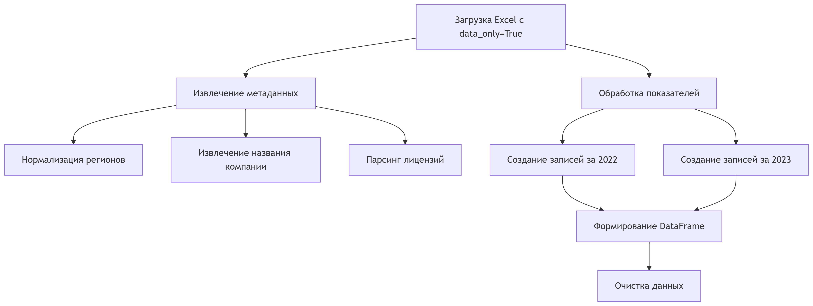
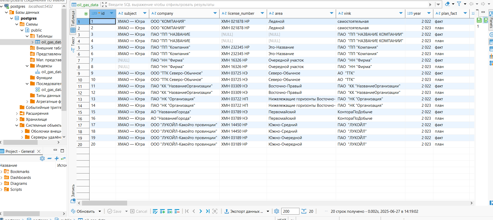

# ETL Pipeline для обработки данных нефтегазовой отрасли

## 📌 Обзор процесса
ETL-пайплайн преобразует сырые Excel-файлы с показателями нефтегазовых компаний в структурированные данные, готовые для анализа и загрузки в БД.

## 🔧 Технологический стек
- Python 3.11.9+
- Библиотеки: pandas, openpyxl, psycopg2, sqlalchemy
- PostgreSQL 17+ (для финального хранения)

## 🔄 Процесс обработки Excel-файлов

### 1. Подготовка и настройка

# Установка зависимостей
pip install pandas openpyxl psycopg2-binary sqlalchemy

# Импорт библиотек
from openpyxl import load_workbook
import pandas as pd

### 2. Основной алгоритм обработки

## Все маппинги, огромные словари занесены в отдельный файл map.py
С целью снятия перегрузки с рабочего кода.

## Ключевые функции:
```python
extract_metadata(sheet) - извлекает основные мета данные из файлов:

Субъект РФ (нормализация через REGION_NORMALIZATION)

Наименование компании (по ключевым фразам)

Данные лицензии (номер, участок)

ВИНК (недропользователь)

normalize_region(region_name) - стандартизирует названия регионов:


REGION_NORMALIZATION = {
    r'хмао[\s\-]?югр[аы]': 'ХМАО — Югра',
    r'ямал[\w\s\-]*округ': 'Ямало-Ненецкий АО'
}

```
```python
process_workbook(file_path) - основной процесс:
Чтение всех листов книги

Определение колонок с данными (план/факт)

Построчная обработка показателей через INDICATOR_MAPPING

3. Работа с показателями
Используется словарь INDICATOR_MAPPING для сопоставления кодов показателей (например "1.1.") с их полными названиями.

Пример обработки:

if p_p in INDICATOR_MAPPING:
    col_name = INDICATOR_MAPPING[p_p]
    records_2022[col_name] = fact_value
    records_2023[col_name] = plan_value
```
4. Сохранение промежуточных результатов
```python
# Сохранение в Excel и CSV
def save_results(df, base_path):
    # Сохранение в Excel
    excel_path = f"{base_path}/результат.xlsx"
    df.to_excel(excel_path, index=False)
    
    # Сохранение в CSV
    csv_path = f"{base_path}/результат.csv"
    df.to_csv(csv_path, index=False, encoding='utf-8-sig')
```
### 3🗃️ Загрузка данных в БД

1. Подключение к PostgreSQL
```python
from sqlalchemy import create_engine

engine = create_engine('')
```
2. Схема БД
Создаем таблицу
```sql
CREATE TABLE oil_gas_data (
    id SERIAL PRIMARY KEY,
    subject VARCHAR(100),
    company VARCHAR(200),
    license_number VARCHAR(50),
    area VARCHAR(200),
    year INTEGER,
    plan_fact VARCHAR(10),
    -- ... все показатели из словаря в файле мap.py SHORT_NAMES , которые получает ключ числовой из словаря INDICATOR_MAPPING, выдает короткое латинское название для создания --уникальной колонки в базе данных
);
```
3. Заливка в бд
в результате имеем таблицу в бд


### Общая схема ETL-пайплайна

```plaintext
[Входные данные]
│
▼
[Excel файл (in.xlsx)] 
│
▼
[ETL-скрипт] 
├─ Преобразование данных
├─ Очистка данных
└─ Разбивка по показателям
│
├─▶ [Плоская таблица Excel (результат.xlsx)] 
│   (Структурированные данные с колонками показателей)
│
├─▶ [CSV файл (результат.csv)] 
│   (Альтернативный формат для данных)
│
▼
[Загрузка в БД]
│
▼
[База данных]
├─ Таблицы с обработанными данными
│  ├─ Показатели (факт/план)
│  └─ Метаданные
│
▼
[Визуализация]
├─ Дашборды
└─ Аналитические отчеты (сравнение факт/план) - это логический этап. в мой пайплайн не включен
```
